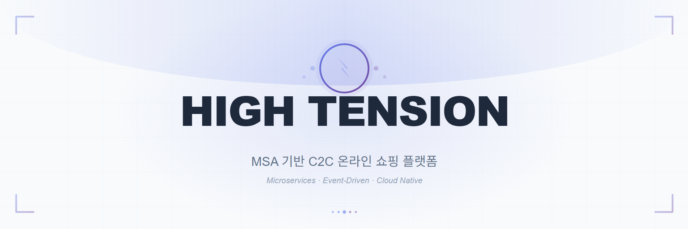
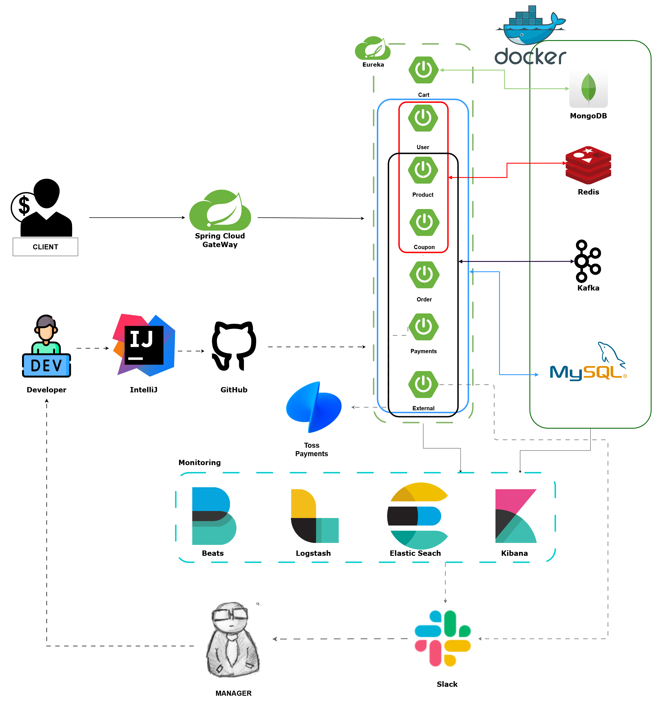
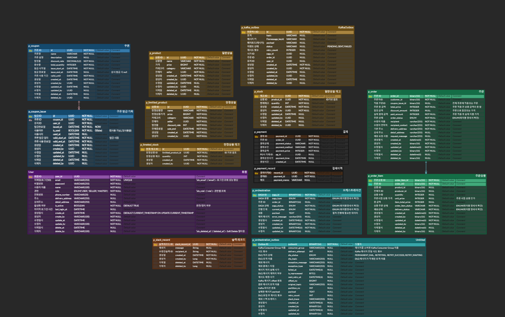

# 🛍️ 온라인 쇼핑 플랫폼 - HIGH TENSION




<br>
<br>

## 목차
- [프로젝트 개요](#project-overview-프로젝트-개요)
- [팀 소개](#team-members-팀원)
- [기술 스택](#technology-stack-기술-스택)
- [ERD 및 시스템 아키텍처](#erd-및-시스템-아키텍처)
- [기능 상세](#features-기능-상세)
- [프로젝트 구조](#project-structure-프로젝트-구조)
- [개발 워크플로우](#development-workflow-개발-워크플로우)
- [기술 문서](#기술-문서)

<br>


# Project Overview (프로젝트 개요)
MSA 아키텍처를 기반으로 핵심 커머스 기능을 유연하게 제공하는 C2C 온라인 쇼핑 플랫폼.<br>
개인 판매자와 구매자가 직접 거래할 수 있으며, 상품 검색부터 장바구니, 주문, 결제까지의 이커머스 핵심 흐름을
주문 오케스트레이션 기반으로 구현하여 대규모 트래픽 환경에서도 안정적인 처리와 일관된 사용자 경험을 제공하는 것을 목표로 한다.

<br>

## 사용자 주요 기능
- 사용자는 SELLER(판매자)와 USER(구매자)로 구분되며 회원가입 및 로그인 후 서비스를 이용할 수 있습니다.
- 유저는 상품 조회, 장바구니 담기, 주문 및 결제, 쿠폰 사용 기능을 이용할 수 있습니다.
- MASTER(관리자)는 사용자, 상품, 거래 정보, 이벤트 쿠폰 발급을 관리하여 서비스의 안정적인 운영을 담당합니다.
- 판매자는 상품 등록·수정·삭제 및 주문 관리 기능을 수행할 수 있습니다.
- 주문 및 결제 상태 변경 시 알림을 통해 사용자에게 안내합니다.

<br>

## 📅개발 기간
| 기간                       | 단계             | 주요 내용 |
|--------------------------|----------------|----------|
| 2025.11.24(월) ~ 11.27(목) | 프로젝트 설계 및 SA 작성 | 프로젝트 주제 선정 및 기획서 작성<br/>사용 기술 선정 |
| 2025.11.28(금) ~ 12.10(수) | MVP 개발         | 기본 동작에 집중한 구현 코드 작성<br/>메인 기술 구현 |
| 2025.12.11(목) ~ 12.21(일) | 고도화 및 트러블 슈팅   | 성능 및 서비스 안정성을 고려한 고도화 개발<br/>주요 트러블 슈팅 |
| 2025.12.22(월) ~ 12.24(수) | 프로젝트 점검 및 테스트  | 통합 테스트 진행<br/>성능 및 부하 테스트 |

각 단계별로 목표를 설정하고 MVP → 고도화 → 안정화 순으로 개발을 진행했습니다.

<br>

# 👥Team Members (팀원)
| 이름  | 역할 |     담당 파트      |                                                                       Github                                                                        |
|:---:|:--:|:--------------:|:---------------------------------------------------------------------------------------------------------------------------------------------------:|
| 박용재 | 팀장 | 장바구니, 알림, 모니터링 | <a href="https://github.com/SearchColor"></a> |
| 박근용 | 멤버 |   유저, 게이트웨이    | <a href="https://github.com/GoodNyong"></a>    |
| 박진성 | 멤버 |       상품       |  <a href="https://github.com/Sp-PJS"></a>  |
| 정민지 | 멤버 |  주문, 오케스트레이션   |  <a href="https://github.com/6uiwj"></a>  |
| 안소나 | 멤버 |       쿠폰       |  <a href="https://github.com/sonaanweb"></a>   |
| 김현수 | 멤버 |       결제       |  <a href="https://github.com/kinhyunsu"></a>    |


</br>

# 🛠️Technology Stack (기술 스택)

### Backend


### Database & Cache


### Messaging


### Logging & Monitoring (ELK Stack)


### Infrastructure & DevOps


### Tools & Collaboration


<br>
<br>

# 🌐ERD 및 시스템 아키텍처




<br>
<br>


# 🗝️Features (기능 상세)

## 1) 주문 오케스트레이션 (Saga 기반 분산 트랜잭션 관리)

### 주문 오케스트레이션
- 분산 환경에서 주문 생성 과정의 일관성을 보장하기 위해 Saga Orchestration 패턴을 적용하였습니다.
    - 주문, 재고, 결제, 장바구니, 쿠폰 서비스 간의 흐름을 중앙 오케스트레이터에서 제어하도록 설계하였습니다.
- Kafka 기반 이벤트 흐름을 활용한 중앙 제어 방식의 오케스트레이터를 구현하였습니다.
    - 오케스트레이션 서비스는 각 단계별 이벤트(StockDeductionSuccess, PaymentCreateSuccess 등)를 소비하고, 다음 단계 이벤트를 발행하거나 실패 시 보상 트랜잭션을 실행하도록 구성했습니다.
- 각 단계별 성공/실패 이벤트를 기준으로 Saga 상태를 관리하였습니다.
    - Saga 엔티티를 별도로 두어 Saga Type과 상태, 진행 단계를 관리하고, 이를 통해 현재 주문이 어느 단계에서 실패했는지 추적 가능하도록 했습니다.
- 보상 트랜잭션(Compensation)을 명시적으로 구현하여 일부 단계 실패 시 이전 작업을 롤백하도록 설계했습니다.
    - 예: 결제 실패 시 → 재고 복원 이벤트 → 주문 삭제 이벤트 발행
    - 예: 재고 차감 실패 시 → 주문 삭제 이벤트 발행
- Kafka 재시도 및 DLQ(Dead Letter Queue)를 적용하여 장애 복원력을 강화했습니다.
    - 일시적 오류에 대해서는 지수 backOff를 적용하여 Retry Topic을 통해 재처리하도록 구현하였습니다.
    - 지정 횟수 초과 시 DLQ로 메시지를 이동시켜 후속 처리가 가능하도록 구성했습니다.
    - 최종 실패시 수동 관리할 수 있도록, 관리자에게 에러 발생 지점과 에러 내용을 담은 슬랙 메시지를 보내도록 처리했습니다.
- 이벤트 유실 방지를 위해 Outbox 패턴을 적용하였습니다.
    - 트랜잭션 부하 및 TPS 저하 문제를 고려해, 정상 이벤트는 Retry 메커니즘으로 처리하고, 유실 시 비즈니스 영향이 큰 실패 토픽에만 Outbox 패턴을 제한적으로 적용하여, 안정성을 확보하면서도 전체 주문 처리 성능을 유지하는 구조를 설계했습니다.

---

## 2) 사용자 흐름 기반 기능

### 회원
- USER, SELLER, MASTER 3단계 권한 체계(RBAC)를 통해 권한 기반 접근 제어를 구현하였으며, JWT 기반 인증(Access Token 1시간, Refresh Token 7일)과 Redis를 활용한 토큰 관리 및 블랙리스트 처리로 보안성을 강화했습니다.
    - Refresh Token Rotation 정책을 적용하여 토큰 탈취 위험을 최소화하였습니다.
  - 회원가입/로그인/로그아웃: 이메일 기반 계정 관리를 지원하며, 비밀번호는 8자 이상 영문+숫자+특수문자 조합을 필수로 검증합니다.
      - 내 정보 조회/수정, 비밀번호 변경, 회원 탈퇴(Soft Delete) 기능을 제공합니다.
  - 패스키 로그인: WebAuthn/FIDO2 표준을 준수하여 생체 인증 또는 보안 키를 통한 비밀번호 없는 로그인을 지원합니다.
      - Username-less 인증 지원으로 이메일 없이도 로그인이 가능하며, 여러 기기에 패스키를 등록할 수 있습니다.
      - 패스키 등록/조회/수정/삭제 기능을 제공하며, Challenge는 TTL 5분으로 자동 만료됩니다.
  - 관리자 기능: MASTER 권한 사용자는 이메일 기반 사용자 검색 및 권한 변경 기능을 사용할 수 있습니다.
  - 서비스 간 연동
      - Coupon Service와 FeignClient 연동을 통해 내 쿠폰 조회 기능을 제공하며, Fallback 패턴 적용으로 장애 시에도 안정성을 보장합니다.
      - Internal API를 통해 다른 서비스(Order, Payment, Coupon)에서 단건/다건 사용자 정보 조회가 가능하며, Gateway에서 JWT 검증 후 X-User-Id, X-User-Role 헤더를 자동 전달합니다.
---

### 상품
- 상품 생성은 SELLER, MASTER 권한만 가능합니다.
- 상품 조회는 인증된 어떠한 권한이라도 가능합니다.(조회에는 Redis 캐싱, 나머지는 @CacheEvict 적용)
- 상품 서비스는 주문 서비스와 FeignClient 통신을 통해 어떤 상품을 몇 개 구매하는지 알 수 있고 이를 재고 차감 / 복원 이벤트로 처리하여 오케스트레이션 서비스로 전달합니다.
- 상품 재고 차감 / 복원 이벤트 처리를 오케스트레이션에서 중앙 집중 처리하며 컨슈머(Redis에 sagaId를 저장하여 이벤트 중복처리 체크, Retry(3회 재시도) & DLQ 구현 및 관련 설정 추가),
  프로듀서(아웃박스 패턴, 멱등성 설정 추가)에 재고 데이터 정합성, Saga패턴 정합성을 위한 멱등성을 구현했습니다.
- 상품 재고 차감/ 복원 이벤트의 재고 데이터 정합성을 위해 Redisson 기반 멀티 분산 락을 직접 구현해서 락 안에서 트랜잭션을 실행 후 종료하고 락을 해제하도록 구현했습니다.
- 주문 서비스와 상품 서비스 간의 FeignClient 통신에서 Redis 캐싱 된 데이터 조회 시, 직렬화 에러 및 오염되는 현상을 Internal API로 분리하여 해결했습니다. [2026.02.13 에러 해결]
- Redis, DB의 커넥션 풀 및 타임아웃 설정, Redisson 멀티 분산 락의 옵션 값(waitTime, leaseTime, Watchdog)을 조정하여 Jmeter를 통한 테스트 결과 평균 응답 속도를 232ms까지 개선했습니다. [2026.02.13 성능 개선]
- Redisson의 Watchdog 옵션을 활성화 했습니다. [2026.04.16 leaseTime 수치 변경]
- 불필요한 코드를 제거했고 Application 계층에서 infra 계층을 참조하는 구조적인 문제 & 재고 차감/복원 실패 시, 아웃박스 테이블을 생성하는 로직을 추가하여 구조적인 결함을 해결했습니다. [2026.04.19 헥사고날 아키텍처 보완, 재고 데이터/Saga 데이터 정합성 보완]
<br>

<h4>동시 요청 1000건 이상에서의 한계점[2026.04.27 추가]</h4>
<br>

- 한계: Jmeter를 통한 1000건 이상에서의 동시 요청에서 에러율 급증(64.8%), 데이터 정합성이 깨지는 문제, 병목현상(처리량 및 평균 응답속도 저하)등의 한계점 식별했습니다.
- 해결 방법: DB/Reids의 부하를 고려하여 Redisson의 옵션 값(waitTime, leaseTime, Watchdog) 변경, 커넥션 풀 & 타임 아웃 설정을 통해 평균 응답속도(2932ms)와 처리량(31.5/sec)을 개선했지만 데이터 정합성 문제와 에러율 문제는 해결하지 못했습니다.
- 추가적인 예상 해결 방법: Redisson 멀티 분산 락 구조 변경(직접 구현 -> 멀티 분산 락 라이브러리 사용), 기존 스케쥴링을 통한 Polling & 메시지 발행을 CDC(Debezium)로 교체, Kafka 파티셔닝 전략 & Consumer 수평 확장 도입을 고려하고 있습니다.

<br>
<h4> 결과트리</h4>

<br>

<h4>요약보고서</h4>


---

### 장바구니
- MongoDB 기반 아키텍처: 빈번한 조회/수정 작업에 최적화된 NoSQL 데이터베이스를 채택하여 RDB 대비 높은 성능을 제공하며, Embedded Document 패턴을 통해 장바구니와 상품 정보를 단일 문서로 관리합니다.
    - @Document(collection = "carts")로 MongoDB 컬렉션을 정의하고, userId에 @Indexed(unique = true)를 적용하여 사용자별 장바구니 유일성을 보장합니다.
    - 장바구니 내 총 금액(totalPrice)을 자동 계산하여 별도 집계 쿼리 없이 즉시 조회가 가능합니다.
    - 'List<CartItem>'을 내장하여 상품 정보(productId, quantity, price)를 함께 저장하며, 단일 쿼리로 전체 장바구니 데이터를 조회할 수 있습니다.
- Kafka 이벤트 기반 처리: 주문 완료 시 Order Service에서 발행하는 clear-cart 토픽을 Kafka Consumer로 구독하여 비동기적으로 장바구니를 비우는 기능을 구현했습니다.

---

### 주문
- 주문 생성, 조회, 상태 관리 기능 등이 존재하며, 주문 생성 시 단일 서비스 트랜잭션이 아닌 다수의 도메인(재고, 결제, 쿠폰 등)이 연관되는 구조로 설계하였습니다.
    - 주문 엔티티는 CREATED, SUCCESS, CANCELED 등의 상태 값을 가지도록 설계하여, 주문의 진행 단계를 명확히 관리했습니다.
- 주문(Order)과 주문상품(OrderItem)을 분리하여 설계하고, 주문은 전체 거래 흐름을 대표하는 단위로, 주문상품은 실제 처리 단위로 역할을 명확히 구분하였습니다.
    - 하나의 주문에 여러 상품이 포함될 수 있는 구조를 고려해 1:N 관계로 모델링하였으며, 주문은 전체 흐름을 나타내는 상태만 관리하고, 주문상품은 개별 상품 처리 상태를 별도로 관리하도록 구현했습니다. 이를 통해 일부 상품만 취소할 수 있고 배송상태를 추적할 수 있도록 하였습니다.
- 주문 생성 요청 시 즉시 DB에 주문을 생성하고 상태를 저장한 뒤, 이벤트를 발행하는 방식(Event-driven) 으로 구현하여 서비스 간 결합도를 낮췄습니다.
    - Spring Boot + JPA를 사용해 주문 데이터를 영속화하고, 주문 생성 완료 후 Kafka 토픽으로 OrderCreateRequested 이벤트를 발행하였습니다.
- 주문 도메인에 RBAC(Role-Based Access Control)를 적용하여 역할별 접근 제어를 구현하였습니다.
    - USER, SELLER, MASTER 3단계 권한 체계를 기반으로 주문 관련 API 접근을 제한했습니다.
    - 일반 사용자(USER)는 본인의 주문 생성 및 조회만 가능하도록 제한하였습니다.
    - 판매자(SELLER)는 자신이 판매한 상품에 대한 주문 조회 및 상태 확인만 가능합니다.
    - 논리 삭제를 적용하여 MASTER는 삭제된 데이터에도 접근 가능합니다.

---

### 쿠폰
- 쿠폰 생성 및 생성 쿠폰 관리는 MASTER 권한만 접근 가능하며, 쿠폰 발급은 USER만 가능합니다.
- 사용자 별 보유 쿠폰 조회·사용·복원·유효성 검증 로직은 다른 서비스에서 Feign Client로 호출되는 내부 전용 기능이므로, 외부 노출을 방지하기 위해 INTERNAL API로 분리했습니다.
- **쿠폰 발급**
    - 쿠폰 발급 요청 시 **사용자 응답은 동기, 반영 로직은 Kafka 이벤트 기반으로 비동기 처리**로 분리하여 응답 속도와 시스템 안정성이 확보되도록 설계했습니다.
    - 발급 검증 로직은 **Redis Lua Script로 처리하여 발급 자격 검증과 수량 차감을 단일 원자 연산으로 수행**함으로써 동시성을 제어했습니다.
    - 반복적으로 조회되는 **쿠폰 메타 정보를 Local Cache (Caffeine)로 관리하여 불필요한 DB 조회를 제거**하고 발급 성능을 개선했습니다.
    - 선착순 발급을 위해 Redis에 저장되는 발급 사용자 데이터는 이벤트 종료일 + 여유 기간(3일) 기준으로 TTL을 설정하여 메모리 사용율을 개선했습니다.
    - 쿠폰 발급은 Redis 검증 이후 Kafka 이벤트 기반으로 DB에 반영되며, **DB/네트워크 장애로 인한 발급 이력 누락을 방지하기 위해 Consumer에 RetryableTopic과 DLT를 적용**했습니다.
        - Exponential Backoff 기반 최대 3회 재시도
        - 재시도 실패 시 DLT 적재 및 후속 처리 가능하도록 구성
- **쿠폰 사용**
    - 쿠폰 사용 시 발생할 수 있는 동시성 이슈를 고려하여, 조회 시점이 아닌 업데이트 시점에 유효성 검증을 수행하는 **DB Atomic Update 방식으로 중복 사용을 방지**했습니다.

---

### 결제
- 결제 도메인 분리: 주문(Order)과 결제를 명확히 분리한 MSA 구조로 설계하여, 결제 생성과 결제 완료의 책임을 분리하고 서비스 간 결합도를 최소화했습니다.
    - 결제 생성 시점에는 결제 금액, 주문 ID 등 **결제 요청 정보만 저장**하며, 실제 결제 성공 여부는 Webhook 기반으로 비동기 확정합니다.
- 결제 흐름
    - Order Service → Payment Service 결제 생성
    - PG(Iamport) 결제 진행 후 Webhook 수신
    - 결제 상태 및 금액 정합성 검증 후 결제 완료 확정
    - 결제 완료 이벤트를 Kafka로 발행하여 Order Service에 반영
- PG 연동 및 보안
    - Iamport PG 연동을 통해 실제 결제를 처리하며, Webhook 수신 시 **PG API 재조회 기반 검증**으로 위·변조를 방지합니다.
    - 내부 결제 금액과 PG 결제 금액을 비교하여 불일치 시 즉시 실패 처리합니다.
- 결제 상태 관리
    - 결제 상태를 PENDING → COMPLETED / FAILED 형태로 관리하여 중간 장애 상황에서도 정합성을 유지합니다.
    - 결제 생성과 완료를 분리함으로써 네트워크 지연, PG 응답 오류로 인한 데이터 불일치 문제를 방지합니다.
- Outbox 패턴 기반 이벤트 처리
    - 결제 완료 시 Outbox 테이블에 이벤트를 먼저 저장한 뒤, **Outbox Publisher**를 통해 Kafka로 이벤트를 발행합니다.
    - DB 트랜잭션과 이벤트 발행의 원자성을 보장하여 이벤트 유실을 방지합니다.
- Kafka 멱등성 보장
    - Producer 멱등성 설정과 Outbox 패턴을 결합하여 중복 이벤트 발행을 방지합니다.
    - Consumer 단에서는 sagaId 기반 중복 처리 방지 로직을 적용하여 결제 이벤트의 재처리 안정성을 확보했습니다.
- 장애 대응 및 안정성
    - 결제 이벤트 발행 실패 시 재시도 및 최종 실패 상태를 관리하여 장애 상황에서도 결제 상태 추적이 가능하도록 설계했습니다.
    - 결제 관련 주요 이벤트에 대해 로깅 및 모니터링이 가능하도록 구성했습니다.
- 내부 서비스 연동
    - Order Service와는 Kafka 기반 비동기 통신으로 결제 완료 상태를 전달합니다.
    - Internal API를 통해 결제 단건/목록 조회가 가능하며, Gateway에서 전달된 사용자 인증 정보를 기반으로 접근 제어를 수행합니다.

---

### 외부 연동(External)
- Slack API 연동 기반 알림 시스템: Slack Webhook을 활용하여 주문 완료, 시스템 에러 등 주요 이벤트를 실시간으로 Slack 채널에 전송하며, 발송 이력을 RDB에 기록하여 추적성을 확보합니다.
    - SlackNotifier 도메인 서비스를 통해 Slack API 호출을 추상화하고, 메시지 발송과 동시에 SlackRecord 엔티티로 발송 이력을 저장합니다.
    - recipientId(채널 ID), message(메시지 내용), timestamp(발송 시각)를 기록하여 알림 이력 조회 및 감사 추적이 가능합니다.
    - Soft Delete 패턴(@SQLRestriction("deleted_at IS NULL"))을 적용하여 삭제된 기록도 데이터베이스에 보관하며, 복구 및 분석에 활용합니다.
- Kafka 이벤트 기반 알림 처리: 2개의 Kafka Consumer를 통해 주문 완료 및 시스템 에러 이벤트를 비동기적으로 수신하여 Slack 알림을 자동 발송합니다.
    - OrderProcessSuccessEventConsumer: order-process-success 토픽을 구독하여 주문 완료 시 주문 번호, 주문 날짜, 상품명, 결제 금액을 포함한 알림을 발송합니다.
    - 주문 상품이 여러 건인 경우 "상품명 외 N건" 형식으로 요약하여 가독성을 높입니다.
    - SlackNotificationEventConsumer: alert-slack-topic을 구독하여 서비스 에러 발생 시 service-name, api-url, message, timestamp를 포함한 에러 알림을 발송합니다.
    - Kafka 메시지의 topic, partition, offset 정보를 로깅하여 메시지 추적성과 디버깅 효율성을 확보합니다.
    - 예외 발생 시 로그를 남기고 재처리를 위해 예외를 다시 throw하여 Kafka의 재시도 메커니즘을 활용합니다.
- Slack 발송 기록 관리: MASTER 권한 사용자만 Slack 발송 이력을 조회, 페이징, 삭제할 수 있으며, 감사 추적 및 모니터링 목적으로 활용됩니다.
    - Soft Delete(DELETE /api/v1/externals/slacks/{id}): 물리적 삭제 대신 deleted_at 필드를 업데이트하여 데이터를 보존하고, SecurityContextUtil을 통해 삭제 수행자를 자동 기록합니다.
- 권한 기반 접근 제어: MASTER 권한 사용자만 Slack 발송 기록 조회/삭제 및 수동 메시지 발송 API를 호출할 수 있습니다.
    - Gateway에서 전달받은 X-User-Role 헤더를 기반으로 권한을 검증하며, 권한이 없는 경우 403 Forbidden 응답을 반환합니다.
    - 테스트용 에러 로그 발생 API(GET /api/v1/externals/slacks/test/error)를 제공하여 Kibana 파이프라인 및 로그 수집 시스템을 검증할 수 있습니다.
- 트랜잭션 및 예외 처리: @Transactional을 적용하여 Slack 기록 삭제 작업의 원자성을 보장하며, Slack API 호출 실패 시 RuntimeException을 발생시켜 일관된 예외 처리를 제공합니다.
    - 공통 응답 형식(ApiResponse<T>)을 사용하여 성공/실패 메시지를 표준화하고, PageResponse를 통해 페이징 메타데이터(totalElements, totalPages, currentPage)를 함께 반환합니다.

---

## 3) 공통 인프라 및 운영 지원


### API Gateway
- Eureka 기반 서비스 디스커버리를 통해 8개 마이크로서비스(User, Product, Payment, Order, External, Coupon, Cart, Orchestration)를 자동으로 라우팅하며, `/docs` 엔드포인트에서 전체 서비스 API 문서를 통합 조회할 수 있습니다.
- JWT 인증 필터를 통해 User Service와 동일한 서명 검증을 수행하며, Redis 블랙리스트 체크로 로그아웃된 토큰을 자동 차단합니다.
    - JWT에서 추출한 사용자 정보(X-User-Id, X-User-Role)를 백엔드 서비스로 자동 전달하여 인증 정보를 공유합니다.
- Rate Limiting: Token Bucket 알고리즘(Bucket 크기 100, Refill 속도 10/sec)을 적용하여 사용자별 독립적인 요청 제한을 구현하였으며, Redis Lua Script로 원자성을 보장합니다.
    - 비인증 사용자는 IP 기반 Rate Limiting이 적용되며, 응답 헤더(X-RateLimit-Limit/Remaining, Retry-After)를 제공합니다.
- 타임아웃 및 안정성: HTTP Client Timeout(연결 5초, 응답 30초), Netty Idle Timeout(30초)을 설정하여 Slowloris 공격을 방어하며, Connection Pool(최대 500 연결)을 관리합니다.
- Circuit Breaker: Resilience4j를 적용하여 백엔드 서비스 장애 시 자동 차단(50% 실패 시 OPEN, 30초 대기 후 HALF_OPEN)하며, Fallback Controller로 503 응답을 제공합니다.
    - 상태 전환 이벤트 로깅 및 Actuator 엔드포인트(`/internal/actuator/circuitbreakers`)를 통한 실시간 모니터링을 지원합니다.
- Gateway 전용 에러 코드(9000-9999)를 할당하여 JWT 인증(9000-9099), Rate Limiting(9200-9299), Circuit Breaker(9300-9399) 에러를 표준화하였으며, WebFlux 호환 GlobalExceptionHandler로 비동기 환경에서 안정적인 예외 처리를 구현하였습니다.

---

### 모니터링 및 로그 관리
- ELK Stack 기반 중앙집중식 로깅 시스템: Logback → Filebeat → Kafka → Logstash → Elasticsearch → Kibana 파이프라인을 구축하여 8개 마이크로서비스의 로그를 실시간으로 수집, 가공, 저장, 시각화합니다.
    - 각 서비스는 독립적으로 로그를 생성하지만, 중앙화된 시스템을 통해 통합 모니터링 및 장애 추적이 가능합니다.
    - 로그 데이터는 JSON 구조화 포맷으로 저장되어 검색 및 분석 효율성을 극대화합니다.
- Logback JSON 로그 생성: LogstashEncoder를 사용하여 모든 애플리케이션 로그를 JSON 형식으로 구조화하고, MDC(Mapped Diagnostic Context)를 활용하여 HTTP 요청 메타데이터를 자동으로 수집합니다.
    - 수집 필드: http.method, url.path, duration_ms, http.status_code, log.type을 MDC에 저장하여 API 요청별 추적이 가능합니다.
    - service_name을 customFields로 자동 추가하여 멀티 서비스 환경에서 로그 출처를 명확히 구분합니다.
    - 로그 파일 경로: ./logs/${serviceName}-json.log로 서비스별로 분리 저장합니다.
    - 롤링 정책: 파일 크기 50MB 또는 일별로 자동 분할하며, 최대 7일간 보관하고 총 용량 1GB를 초과하면 오래된 로그부터 삭제합니다.
    - 프레임워크 로그 레벨 최적화: Spring, Hibernate, Netflix Eureka 등 프레임워크 로그는 WARN 레벨로 설정하여 노이즈를 줄이고, 애플리케이션 로그(com.high 패키지)는 INFO 레벨로 상세 수집합니다.
- Filebeat 로그 수집: 각 서비스의 로그 파일을 실시간으로 읽어 Kafka로 전송하는 경량 Log Shipper 역할을 수행합니다.
    - 로그 파일 경로: ${APP_LOGS_PATH}를 Docker 볼륨으로 마운트하여 컨테이너 환경에서 안전하게 로그를 수집합니다.
    - Kafka 토픽 전송: msa_app_logs 토픽으로 로그를 비동기 전송하여 애플리케이션 성능에 영향을 주지 않습니다.
    - root 권한으로 실행하여 로그 파일 접근 권한 문제를 방지합니다.
- Kafka 메시지 브로커: Filebeat와 Logstash 사이에서 버퍼 역할을 하며, 로그 유실 방지 및 백프레셔 관리를 제공합니다.
    - msa_app_logs 토픽: Filebeat가 수집한 로그를 Logstash로 중계
    - alert-slack-topic 토픽: Logstash가 감지한 에러 로그를 External 서비스(Slack 알림)로 전달
    - Replication Factor 1로 설정하여 단일 노드 환경에서 안정적으로 동작합니다.
- Logstash 데이터 파이프라인: Kafka Consumer로 로그를 수신하여 파싱, 변환, 필터링, 라우팅을 수행하며, Elasticsearch에 저장하거나 Slack 알림을 트리거합니다.
    - Input 단계: Kafka(msa_app_logs 토픽) 및 TCP 5000 포트를 통해 로그를 수신하며, JSON 코덱으로 자동 파싱합니다.
    - Filter 단계 (데이터 정제 및 가공):
        - service_name 정제: 파일 경로(^.*/) 및 확장자(-json\.log$)를 제거하여 순수 서비스명만 추출 (예: /logs/user-service-json.log → user-service)
        - duration_ms 타입 변환: 문자열을 integer로 변환하여 Kibana에서 수치 연산 및 집계가 가능하도록 최적화
        - Timestamp 정규화: ISO8601 포맷을 파싱하여 Asia/Seoul 타임존으로 변환하고 @timestamp 필드로 통일
        - SQL 로그 자동 분류: logger_name이 org.hibernate.SQL인 경우 log.type을 "sql"로 자동 태깅하여 데이터베이스 쿼리 로그를 별도 분석 가능
        - 에러 알림 자동 감지: level이 "ERROR"이고 log.type이 "api_request"인 로그를 clone하여 slack_alert 타입으로 복제하고, Slack 전송용 필드(targetSlackId, serviceName, urlPath, timestamp)를 추가하여 실시간 에러 알림을 자동화
    - Output 단계 (로그 라우팅):
        - ERROR 레벨 로그 → msa-errors-YYYY.MM.dd 인덱스: 에러 로그를 별도 인덱스로 분리하여 장애 대응 및 분석 효율성을 극대화
        - 일반 로그 → msa-app-logs-YYYY.MM.dd 인덱스: INFO, WARN 등 일반 로그는 날짜별 인덱스로 저장
        - slack_alert 타입 → alert-slack-topic (Kafka): External 서비스가 구독하여 Slack 채널로 실시간 에러 알림 발송
- Elasticsearch 로그 저장소: 로그 데이터를 인덱싱하여 고속 검색 및 집계 쿼리를 지원하며, 날짜별 인덱스 분리로 효율적인 데이터 관리를 제공합니다.
    - 단일 노드 구성(discovery.type=single-node)으로 개발/테스트 환경에 최적화
    - 인덱스 전략: 날짜별 인덱스(msa-app-logs-YYYY.MM.dd, msa-errors-YYYY.MM.dd)로 자동 분할하여 검색 성능을 최적화하고, 오래된 인덱스는 삭제하여 스토리지를 관리
    - 포트 9200 노출로 REST API를 통한 직접 쿼리 및 모니터링 가능
- Kibana 대시보드 시각화: Elasticsearch에 저장된 로그를 실시간 조회하고, 커스텀 대시보드를 통해 API 응답 시간, 에러율, 서비스별 로그 분포 등을 시각화합니다.
    - 포트 5601로 웹 UI 제공
    - Discover 메뉴를 통해 로그 필드별 필터링 및 검색 가능
    - Visualize 를 통해 차트, 그래프, 히트맵 등 다양한 시각화 생성
    - Dashboard 메뉴를 통해 여러 시각화를 조합하여 실시간 모니터링 대시보드 구축
    - 시계열 데이터 분석을 통해 트래픽 패턴, 장애 발생 시점, 성능 병목 구간 등을 직관적으로 파악
- 실시간 에러 알림 자동화: Logstash에서 ERROR 레벨 API 요청을 감지하면 자동으로 Kafka(alert-slack-topic)를 통해 External 서비스로 이벤트를 발행하고, External 서비스의 SlackNotificationEventConsumer가 Slack 채널로 알림을 발송합니다.
    - 에러 발생 즉시 서비스명, API 경로, 에러 메시지, 발생 시각을 포함한 알림을 수신하여 빠른 장애 대응이 가능합니다.
    - 알림 발송 이력은 SlackRecord 엔티티로 저장되어 사후 분석 및 장애 이력 관리를 지원합니다.
- Docker Compose 기반 인프라 구성: 모든 모니터링 컴포넌트(Elasticsearch, Kibana, Logstash, Filebeat, Kafka, Zookeeper)를 단일 docker-compose.yml로 정의하여 원클릭 배포 및 환경 일관성을 확보합니다.
    - 컨테이너 간 통신: msa-network(bridge driver)를 통해 내부 네트워크로 안전하게 연결
    - 데이터 영속성: esdata, mysql-data, redis-data, mongo-data 볼륨을 통해 컨테이너 재시작 시에도 데이터 유지
    - 의존성 관리: depends_on을 통해 Zookeeper → Kafka → Logstash/Filebeat 순서로 시작하여 초기화 오류 방지
    - 리소스 제한: 각 컨테이너에 적절한 메모리 제한(512MB~1GB)을 설정하여 안정적인 운영 보장


  <br>
  <br>


# 📂Project Structure (프로젝트 구조)
```plaintext

Config Server와 API Gateway를 포함한 멀티 모듈 구조로 구성되어 있으며,
보안, JPA 등 공통 기능은 별도의 저장소에서 관리되는 공통 라이브러리를 의존성 형태로 사용합니다.
각 서비스 모듈은 4계층 레이어드 아키텍처를 따릅니다.

└─main
    ├─java
    │  └─com
    │      └─high-tension
    │          └─service-module
    │              ├─application
    │              ├─domain
    │              ├─exception
    │              ├─infrastructure
    │              └─presentation
    └─resources
```

<br>
<br>

# ✈️Development Workflow (개발 워크플로우)

## 브랜치 전략, 커밋 컨벤션
Git Flow를 기반으로 하며, 다음과 같은 브랜치를 사용합니다.

- **Branch**
    - **전략**

      | Branch Type | Description                                       |
      |-------------|---------------------------------------------------|
      | `dev`       | 주요 개발 branch, `main`으로 merge 전 거치는 branch |
      | `feature`   | 각자 개발할 branch, 기능 단위로 생성하기, 할 일 issue 등록 후 branch 생성 및 작업 |

    - **네이밍**
        - `{header}/#{issue number}`
        - 예) `feat/#issueNumr`


- **커밋 메시지 규칙**
    ```bash
    > type: 기능 요약

      - chore: 내부 파일 수정
      - feat: 새로운 기능 구현
      - add: feat 이외의 부수적인 코드 추가, 라이브러리 추가, 새로운 파일 생성 시
      - fix: 코드 수정, 버그, 오류 해결
      - del: 쓸모없는 코드 삭제
      - docs: README나 WIKI 등의 문서 개정
      - move: 프로젝트 내 파일이나 코드의 이동
      - rename: 파일 이름의 변경
      - merge: 다른 브랜치를 merge하는 경우
      - style: 코드가 아닌 스타일 변경을 하는 경우
      - init: Initial commit을 하는 경우
      - refactor: 로직은 변경 없는 클린 코드를 위한 코드 수정

      ex) feat: 게시글 목록 조회 API 구현
    ```

<br>
<br>

# 📃기술 문서
[API 명세서 보기](https://teamsparta.notion.site/2b52dc3ef51481c9a79be84dbfdadcff?v=2b52dc3ef51480c1b562000c3d687efe)
<br>
[테이블 명세서 보기](https://www.notion.so/teamsparta/2b62dc3ef5148036b008e0eb4db77d0d)
<br>
[MVP 기간 오케스트레이션 시연 영상](https://teamsparta.notion.site/MVP-2c62dc3ef51480019711c5d00e2f3acc)
